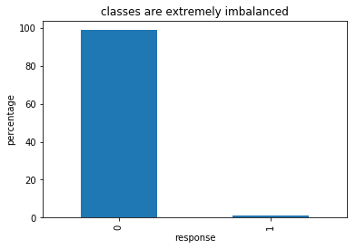
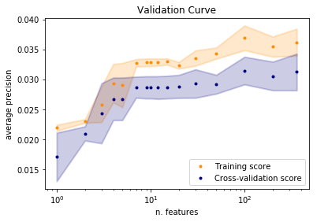
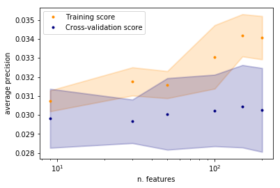
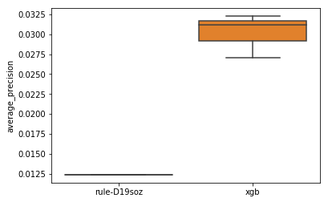
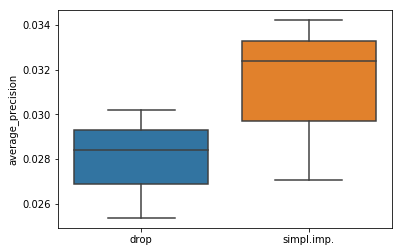

```python
# import libraries here; add more as necessary
import numpy as np
import pandas as pd
import matplotlib.pyplot as plt
import seaborn as sns

# magic word for producing visualizations in notebook
%matplotlib inline

import importlib
from joblib import dump, load

import df_helper as dfh
import df_multinomial as dfm
import proj_support as ps

from sklearn.impute import SimpleImputer
from sklearn.pipeline import Pipeline
from sklearn.compose import ColumnTransformer
from sklearn.preprocessing import OrdinalEncoder,LabelEncoder, StandardScaler, MaxAbsScaler, MinMaxScaler

from sklearn.feature_selection import SelectKBest, SelectPercentile
from sklearn.feature_selection import chi2, f_classif, mutual_info_classif
from sklearn.feature_selection import VarianceThreshold
from sklearn.linear_model import RidgeClassifier
from sklearn.linear_model import LogisticRegression
from sklearn.feature_selection import SelectFromModel
from sklearn.ensemble import ExtraTreesClassifier
# from sklearn.ensemble import ExtraTreesRegressor
from sklearn.neighbors import KNeighborsClassifier
from sklearn.tree  import DecisionTreeClassifier
from sklearn.linear_model  import RidgeClassifier

from sklearn.feature_selection import SelectFromModel
from sklearn.ensemble import RandomForestClassifier
from scipy.stats import randint as sp_randint , uniform
from scipy.stats import chi2_contingency

from sklearn.preprocessing import FunctionTransformer

from sklearn.model_selection import train_test_split, GridSearchCV,RandomizedSearchCV
from sklearn.model_selection import learning_curve, validation_curve, cross_val_score
from sklearn.model_selection import ShuffleSplit, StratifiedKFold

from sklearn.metrics import confusion_matrix, fbeta_score, make_scorer, average_precision_score, auc, \
    accuracy_score, balanced_accuracy_score, precision_score, recall_score, f1_score, classification_report, \
    brier_score_loss, roc_auc_score

from sklearn.experimental import enable_iterative_imputer  # noqa
from sklearn.impute import IterativeImputer, MissingIndicator

import xgboost as xgb
#import lightgbm as lgb
import pickle

import shap
import joblib

# !jupyter nbconvert --to="python"  "fs_val.ipynb"
```


```python
def score_classifier(clf, X_train, y_train, label, scoring="average_precision", cv=3):
    """
    calculates cross_val_score of clf on X_train, y_train and return a DataFrame
    
    """
    
    score = pd.DataFrame(
        cross_val_score(
            clf, X_train, y_train, scoring=scoring,
            cv=cv 
        ),
        columns=[label]
    )    
    return(score)

def loop_cv_score_datasets(clf,datasets,scoring="average_precision", cv=3):
    """
    loops over a set of training data (drop, simple imputation etc) and calculates cross_val_score of clf
    
    e.g. datasets={'drop': ( X_train_drop, y_train_drop), 'simpl.imp.': (X_train_imp, y_train) }
    """
    
    
    score_list=[]
    for k,v in datasets.items():
        print(k)
        score_list.append(score_classifier(clf, v[0], v[1], k, scoring=scoring, cv=cv))
        
    return( pd.concat(score_list,axis=1) )

def loop_cv_score_classifiers(clfs,X_train, y_train,scoring="average_precision", cv=3):
    """
    loops over a set of classifiers and calculates cross_val_score of clf
    
    e.g. datasets={'drop': ( X_train_drop, y_train_drop), 'simpl.imp.': (X_train_imp, y_train) }
    """
    
    
    score_list=[]
    for k,v in clfs.items():
        print(k)
        score_list.append(score_classifier(v, X_train, y_train, k, scoring=scoring, cv=cv))
        
    return( pd.concat(score_list,axis=1) )

def loop_cv_score_classifiers_datasets(clf_Xdata, y_train,scoring="average_precision", cv=3):
    """
    loops over a set of classifiers and calculates cross_val_score of clf
    
    e.g. datasets={'drop': ( X_train_drop, y_train_drop), 'simpl.imp.': (X_train_imp, y_train) }
    """
    
    
    score_list=[]
        
    for k,v in clf_Xdata.items():
        print(k)
        score_list.append(score_classifier(v[0], v[1], y_train, k, scoring=scoring, cv=cv))
        
    return( pd.concat(score_list,axis=1) )

```


```python
importlib.reload(dfh)
importlib.reload(ps)
```


    <module 'proj_support' from 'c:\\X\\ML\\Bertelsmann_capstone\\proj_support.py'>


```python
X_train, X_test, y_train, y_test= ps.load_train_test()
```


```python
(100*y_train.value_counts(normalize=True)).plot(kind='bar')
plt.ylabel('percentage')
plt.xlabel('response')
plt.title('classes are extremely imbalanced')

```


    Text(0.5,1,'classes are extremely imbalanced')





```python
X_train_drop=X_train.dropna()
X_test_drop=X_test.dropna()

y_train_drop=y_train.loc[X_train_drop.index]
y_test_drop=y_test.loc[X_test_drop.index]
```


```python
imp = SimpleImputer(missing_values=np.nan, strategy='most_frequent',copy=False)
imp.fit(X_train)

joblib.dump(imp, 'only_imp.joblib') 

X_train_imp=pd.DataFrame(imp.transform(X_train),columns=X_train.columns,index=X_train.index)
X_test_imp=pd.DataFrame(imp.transform(X_test),columns=X_test.columns,index=X_test.index)
```


```python
X_train_imp.shape
```


    (30073, 360)


```python
X_train.head(5)
```


<div>
<style scoped>
    .dataframe tbody tr th:only-of-type {
        vertical-align: middle;
    }

    .dataframe tbody tr th {
        vertical-align: top;
    }

    .dataframe thead th {
        text-align: right;
    }
</style>
<table border="1" class="dataframe">
  <thead>
    <tr style="text-align: right;">
      <th></th>
      <th>AGER_TYP</th>
      <th>AKT_DAT_KL</th>
      <th>ALTER_HH</th>
      <th>ALTERSKATEGORIE_FEIN</th>
      <th>ANZ_KINDER</th>
      <th>ARBEIT</th>
      <th>BALLRAUM</th>
      <th>CAMEO_DEU_2015</th>
      <th>CAMEO_DEUG_2015</th>
      <th>CAMEO_INTL_2015</th>
      <th>...</th>
      <th>WEALTH</th>
      <th>LIFESTAGE</th>
      <th>ANZ_HAUSHALTE_AKTIV_bin</th>
      <th>ANZ_HH_TITEL_bin</th>
      <th>ANZ_PERSONEN_bin</th>
      <th>ANZ_TITEL_bin</th>
      <th>ANZ_STATISTISCHE_HAUSHALTE_bin</th>
      <th>VERDICHTUNGSRAUM_bin</th>
      <th>MIN_GEBAEUDEJAHR_bin</th>
      <th>GEBURTSJAHR_bin</th>
    </tr>
  </thead>
  <tbody>
    <tr>
      <th>38282</th>
      <td>2.0</td>
      <td>1.0</td>
      <td>9.0</td>
      <td>9.0</td>
      <td>0.0</td>
      <td>2.0</td>
      <td>6.0</td>
      <td>20.0</td>
      <td>5.0</td>
      <td>33.0</td>
      <td>...</td>
      <td>3.0</td>
      <td>3.0</td>
      <td>1.0</td>
      <td>0.0</td>
      <td>2.0</td>
      <td>0.0</td>
      <td>1.0</td>
      <td>0.0</td>
      <td>1994.0</td>
      <td>1950.0</td>
    </tr>
    <tr>
      <th>17413</th>
      <td>3.0</td>
      <td>1.0</td>
      <td>12.0</td>
      <td>12.0</td>
      <td>0.0</td>
      <td>2.0</td>
      <td>2.0</td>
      <td>8.0</td>
      <td>2.0</td>
      <td>14.0</td>
      <td>...</td>
      <td>1.0</td>
      <td>4.0</td>
      <td>6.0</td>
      <td>0.0</td>
      <td>1.0</td>
      <td>0.0</td>
      <td>6.0</td>
      <td>7.0</td>
      <td>1992.0</td>
      <td>1950.0</td>
    </tr>
    <tr>
      <th>15542</th>
      <td>3.0</td>
      <td>3.0</td>
      <td>18.0</td>
      <td>13.0</td>
      <td>0.0</td>
      <td>4.0</td>
      <td>6.0</td>
      <td>21.0</td>
      <td>5.0</td>
      <td>34.0</td>
      <td>...</td>
      <td>3.0</td>
      <td>4.0</td>
      <td>1.0</td>
      <td>0.0</td>
      <td>3.0</td>
      <td>0.0</td>
      <td>1.0</td>
      <td>10.0</td>
      <td>1992.0</td>
      <td>1958.0</td>
    </tr>
    <tr>
      <th>35461</th>
      <td>NaN</td>
      <td>NaN</td>
      <td>NaN</td>
      <td>NaN</td>
      <td>NaN</td>
      <td>NaN</td>
      <td>NaN</td>
      <td>NaN</td>
      <td>NaN</td>
      <td>NaN</td>
      <td>...</td>
      <td>NaN</td>
      <td>NaN</td>
      <td>15.0</td>
      <td>2.0</td>
      <td>7.0</td>
      <td>2.0</td>
      <td>20.0</td>
      <td>10.0</td>
      <td>1998.0</td>
      <td>2005.0</td>
    </tr>
    <tr>
      <th>30825</th>
      <td>2.0</td>
      <td>1.0</td>
      <td>9.0</td>
      <td>11.0</td>
      <td>0.0</td>
      <td>4.0</td>
      <td>2.0</td>
      <td>37.0</td>
      <td>8.0</td>
      <td>54.0</td>
      <td>...</td>
      <td>5.0</td>
      <td>4.0</td>
      <td>11.0</td>
      <td>0.0</td>
      <td>1.0</td>
      <td>0.0</td>
      <td>10.0</td>
      <td>1.0</td>
      <td>1992.0</td>
      <td>1950.0</td>
    </tr>
  </tbody>
</table>
<p>5 rows × 360 columns</p>
</div>


## Feature selection

We use the chi2 FeatureSelection technique in combination with a StratifiedKFold cross-validation loop to assess the best number of features to keep.
The plots show that there is no quantifiable improvement after 7-8 features. This is also confirmed with a chi2 test statistics on the contingency tables.


```python
fs=SelectKBest(chi2)
clf=xgb.XGBClassifier(silent=True,objective='binary:logistic',learning_rate= 0.01,
                                 scale_pos_weight=100)

pipe=Pipeline(steps=[
       ('fs',fs),
       ('clf',clf)
])


```


```python
param_range=[1,2,3,4,5,7,9,10,12,15,20,30,50,100,200,360]
# param_range=[1,3,9,20]

# scoring="roc_auc" #1
scoring="average_precision" 
skf = StratifiedKFold(n_splits=3)

train_scores, valid_scores = validation_curve(pipe, X_train_imp, y_train, "fs__k",
                    param_range,scoring=scoring,
                    cv=skf)
```


```python
ax=dfh.plot_validation_curve(train_scores,valid_scores,"n. features",'average precision')
plt.xscale('Log')
```





```python
param_range=[9,30,50,100,150,200]
scoring="average_precision" 
skf = StratifiedKFold(n_splits=5)

train_scores, valid_scores = validation_curve(pipe, X_train_imp, y_train, "fs__k",
                    param_range,scoring=scoring,
                    cv=skf)
```


```python

param_range=[9,30,50,100,150,200]
scoring="balanced_accuracy" 
skf = StratifiedKFold(n_splits=5)

train_scores, valid_scores = validation_curve(pipe, X_train_imp, y_train, "fs__k",
                    param_range,scoring=scoring,
                    cv=skf)
```


```python
ax=dfh.plot_validation_curve(train_scores,valid_scores,"n. features",'average precision',title='Validation Curve cv=5',leg_loc=2)
plt.xscale('Log')
```





```python
def list_significant_cols_nan(X,Y,threshold=0.1):
    """
    lists the columns of X with the highest  correlation to Y and the percentage of nan
    
    """
    
    pmv_c=dfh.calc_na_columns(X)
    
    signific,cols= dfh.multinomial_chi2_independence(X,Y)

    if threshold is None:
        sig=pd.DataFrame(signific,index=cols,columns=['p-value'])
    else:
        ii=np.nonzero(signific < threshold)[0]
        sig=pd.DataFrame(signific[ii],index=cols[ii],columns=['p-value'])
    sig_cols=list(sig.index)
    col_imp=sig.join(pmv_c,how='left')
    col_imp=col_imp.sort_values(by='p-value')
    
    return(col_imp,pmv_c)
```


```python
col_imp,pmv_c= list_significant_cols_nan(X_train,y_train)
```

    C:\anaconda3\envs\ds\lib\site-packages\scipy\stats\contingency.py:243: RuntimeWarning: invalid value encountered in less
      if np.any(observed < 0):
    C:\anaconda3\envs\ds\lib\site-packages\scipy\stats\_distn_infrastructure.py:877: RuntimeWarning: invalid value encountered in greater
      return (self.a < x) & (x < self.b)
    C:\anaconda3\envs\ds\lib\site-packages\scipy\stats\_distn_infrastructure.py:877: RuntimeWarning: invalid value encountered in less
      return (self.a < x) & (x < self.b)
    C:\anaconda3\envs\ds\lib\site-packages\scipy\stats\_distn_infrastructure.py:1831: RuntimeWarning: invalid value encountered in less_equal
      cond2 = cond0 & (x <= self.a)
    C:\anaconda3\envs\ds\lib\site-packages\ipykernel_launcher.py:14: RuntimeWarning: invalid value encountered in less
      
    


```python
display(col_imp.head(10))
```


<div>
<style scoped>
    .dataframe tbody tr th:only-of-type {
        vertical-align: middle;
    }

    .dataframe tbody tr th {
        vertical-align: top;
    }

    .dataframe thead th {
        text-align: right;
    }
</style>
<table border="1" class="dataframe">
  <thead>
    <tr style="text-align: right;">
      <th></th>
      <th>p-value</th>
      <th>perc.missing</th>
    </tr>
  </thead>
  <tbody>
    <tr>
      <th>D19_SOZIALES</th>
      <td>3.938247e-84</td>
      <td>17.507399</td>
    </tr>
    <tr>
      <th>D19_KONSUMTYP_MAX</th>
      <td>2.380309e-34</td>
      <td>0.000000</td>
    </tr>
    <tr>
      <th>D19_KONSUMTYP</th>
      <td>8.840219e-14</td>
      <td>17.507399</td>
    </tr>
    <tr>
      <th>RT_SCHNAEPPCHEN</th>
      <td>2.224525e-08</td>
      <td>1.443155</td>
    </tr>
    <tr>
      <th>KBA05_CCM4</th>
      <td>3.905764e-05</td>
      <td>20.902471</td>
    </tr>
    <tr>
      <th>KBA05_KW3</th>
      <td>7.780143e-05</td>
      <td>20.902471</td>
    </tr>
    <tr>
      <th>KBA05_ZUL4</th>
      <td>2.908871e-03</td>
      <td>20.902471</td>
    </tr>
    <tr>
      <th>KBA13_MERCEDES</th>
      <td>4.589483e-03</td>
      <td>18.431816</td>
    </tr>
    <tr>
      <th>CJT_KATALOGNUTZER</th>
      <td>5.520500e-03</td>
      <td>1.443155</td>
    </tr>
    <tr>
      <th>KBA05_KW2</th>
      <td>5.602754e-03</td>
      <td>20.902471</td>
    </tr>
  </tbody>
</table>
</div>


```python
fs_sel=list(col_imp.head(10).index)
display(fs_sel)
```


['D19_SOZIALES', 'D19_KONSUMTYP_MAX', 'D19_KONSUMTYP', 'RT_SCHNAEPPCHEN', 'KBA05_CCM4', 'KBA05_KW3', 'KBA05_ZUL4', 'KBA13_MERCEDES', 'CJT_KATALOGNUTZER', 'KBA05_KW2']


```python
XX=X_train.copy()
XX['Y']=y_train

contingency_table=XX.groupby(by='Y')['D19_SOZIALES'].value_counts().unstack()
display(contingency_table)
```


<div>
<style scoped>
    .dataframe tbody tr th:only-of-type {
        vertical-align: middle;
    }

    .dataframe tbody tr th {
        vertical-align: top;
    }

    .dataframe thead th {
        text-align: right;
    }
</style>
<table border="1" class="dataframe">
  <thead>
    <tr style="text-align: right;">
      <th>D19_SOZIALES</th>
      <th>0.0</th>
      <th>1.0</th>
      <th>2.0</th>
      <th>3.0</th>
      <th>4.0</th>
      <th>5.0</th>
    </tr>
    <tr>
      <th>Y</th>
      <th></th>
      <th></th>
      <th></th>
      <th></th>
      <th></th>
      <th></th>
    </tr>
  </thead>
  <tbody>
    <tr>
      <th>0</th>
      <td>6757</td>
      <td>7450</td>
      <td>1017</td>
      <td>6044</td>
      <td>2244</td>
      <td>984</td>
    </tr>
    <tr>
      <th>1</th>
      <td>21</td>
      <td>259</td>
      <td>7</td>
      <td>15</td>
      <td>8</td>
      <td>2</td>
    </tr>
  </tbody>
</table>
</div>


```python
display(dfh.perc_by_row(contingency_table).round(1))
```


<div>
<style scoped>
    .dataframe tbody tr th:only-of-type {
        vertical-align: middle;
    }

    .dataframe tbody tr th {
        vertical-align: top;
    }

    .dataframe thead th {
        text-align: right;
    }
</style>
<table border="1" class="dataframe">
  <thead>
    <tr style="text-align: right;">
      <th>D19_SOZIALES</th>
      <th>0.0</th>
      <th>1.0</th>
      <th>2.0</th>
      <th>3.0</th>
      <th>4.0</th>
      <th>5.0</th>
    </tr>
    <tr>
      <th>Y</th>
      <th></th>
      <th></th>
      <th></th>
      <th></th>
      <th></th>
      <th></th>
    </tr>
  </thead>
  <tbody>
    <tr>
      <th>0</th>
      <td>27.6</td>
      <td>30.4</td>
      <td>4.2</td>
      <td>24.7</td>
      <td>9.2</td>
      <td>4.0</td>
    </tr>
    <tr>
      <th>1</th>
      <td>6.7</td>
      <td>83.0</td>
      <td>2.2</td>
      <td>4.8</td>
      <td>2.6</td>
      <td>0.6</td>
    </tr>
  </tbody>
</table>
</div>


```python
from sklearn.dummy import DummyClassifier
clfd = DummyClassifier(strategy='most_frequent', random_state=0)
xgb_model = xgb.XGBClassifier(silent=True,objective='binary:logistic',learning_rate= 0.01,
                                 scale_pos_weight=100.)

clf_Xdata={'rule-D19soz':(clfd,X_train_imp['D19_SOZIALES']),
           'xgb': (xgb_model,X_train)}

```


```python
X_train_dt1=X_train_imp['D19_SOZIALES'].values.reshape(-1, 1)
X_test_dt1=X_test_imp['D19_SOZIALES'].values.reshape(-1, 1)


```


```python
# clfd = DummyClassifier(strategy='stratified', random_state=0)
clfd = DecisionTreeClassifier(max_depth=1,class_weight='balanced')

clfd.fit(X_train_dt1 ,y_train)
y_pred=clfd.predict(X_test_dt1)

print(classification_report(y_test, y_pred))
```

                  precision    recall  f1-score   support
    
               0       1.00      0.35      0.52     12729
               1       0.02      0.92      0.03       160
    
        accuracy                           0.36     12889
       macro avg       0.51      0.63      0.28     12889
    weighted avg       0.98      0.36      0.51     12889
    
    


```python
dfh.print_cm(y_test, y_pred)
```

    Confusion Matrix
    C true,predicted
    
    [[4438 8291]
     [  13  147]]
    
    true negatives  : true 0, predicted 0:  4438
    false positives : true 0, predicted 1:  8291
    false negatives : true 1, predicted 0:  13
    true positives  : true 1, predicted 1:  147
    


```python
from sklearn.tree import export_graphviz
from IPython.display import SVG
from graphviz import Source
from IPython.display import display
import pydot 

import sys,os,os.path
sys.path.append(os.path.expanduser(r'C:\Program Files (x86)\Graphviz2.38\bin'))

graph = Source(export_graphviz(clfd, out_file=None
   , feature_names=['D19_SOZIALES'], class_names=['0', '1'] 
   , filled = True))
display(SVG(graph.pipe(format='svg')))


```


```python
res_d_x=loop_cv_score_classifiers_datasets(clf_Xdata, y_train,scoring="average_precision", cv=3)
```

    rule-D19soz
    xgb
    


```python
sns.boxplot(data=res_d_x)
plt.ylabel("average_precision");
```





```python
# find the columns to input the selected features

fs=SelectKBest(chi2,k=10)
X_col=X_train_drop.columns
imp_col=set([])

for n in range(0,len(fs_sel)):
    fs.fit( X_train_drop,X_train_drop[fs_sel[n]] )
    imp_col=imp_col.union( set( X_col[fs.get_support()] )) 

    
    

```


```python
print(list(imp_col))
```

    ['RT_SCHNAEPPCHEN', 'ANZ_HAUSHALTE_AKTIV_bin', 'LP_FAMILIE_FEIN', 'LP_STATUS_FEIN', 'D19_VERSAND_ONLINE_QUOTE_12', 'D19_VERSAND_ANZ_12', 'D19_VERSAND_ANZ_24', 'KBA13_HERST_BMW_BENZ', 'KBA05_KW2', 'KBA05_MOD1', 'KBA05_CCM1', 'D19_GESAMT_DATUM', 'KBA05_MOD4', 'KBA05_KRSZUL', 'KBA05_CCM4', 'ANZ_STATISTISCHE_HAUSHALTE_bin', 'D19_GESAMT_ANZ_24', 'D19_GESAMT_ONLINE_QUOTE_12', 'KBA05_KW3', 'CAMEO_INTL_2015', 'KBA13_ANZAHL_PKW', 'KBA13_SEG_SPORTWAGEN', 'D19_KONSUMTYP', 'KBA05_MAXBJ', 'KBA05_ZUL4', 'D19_GESAMT_ANZ_12', 'LP_LEBENSPHASE_FEIN', 'GENERATION_DECADE', 'D19_SOZIALES', 'VK_DHT4A', 'D19_KONSUMTYP_MAX', 'GEMEINDETYP', 'D19_BANKEN_ONLINE_QUOTE_12', 'CJT_KATALOGNUTZER', 'KBA05_SEG5', 'KBA05_HERST1', 'EXTSEL992', 'CAMEO_DEU_2015', 'KBA13_SITZE_5', 'KBA05_KW1', 'KBA13_SEG_OBEREMITTELKLASSE', 'KBA13_MERCEDES']
    


```python
X_train[imp_col].describe().loc[['25%','75%']].T
```


<div>
<style scoped>
    .dataframe tbody tr th:only-of-type {
        vertical-align: middle;
    }

    .dataframe tbody tr th {
        vertical-align: top;
    }

    .dataframe thead th {
        text-align: right;
    }
</style>
<table border="1" class="dataframe">
  <thead>
    <tr style="text-align: right;">
      <th></th>
      <th>25%</th>
      <th>75%</th>
    </tr>
  </thead>
  <tbody>
    <tr>
      <th>D19_KONSUMTYP</th>
      <td>2.0</td>
      <td>4.0</td>
    </tr>
    <tr>
      <th>KBA13_MERCEDES</th>
      <td>3.0</td>
      <td>4.0</td>
    </tr>
    <tr>
      <th>LP_LEBENSPHASE_FEIN</th>
      <td>6.0</td>
      <td>32.0</td>
    </tr>
    <tr>
      <th>D19_GESAMT_ONLINE_QUOTE_12</th>
      <td>0.0</td>
      <td>8.0</td>
    </tr>
    <tr>
      <th>ANZ_STATISTISCHE_HAUSHALTE_bin</th>
      <td>1.0</td>
      <td>15.0</td>
    </tr>
    <tr>
      <th>D19_VERSAND_ONLINE_QUOTE_12</th>
      <td>0.0</td>
      <td>5.0</td>
    </tr>
    <tr>
      <th>KBA05_KW2</th>
      <td>2.0</td>
      <td>4.0</td>
    </tr>
    <tr>
      <th>D19_SOZIALES</th>
      <td>0.0</td>
      <td>3.0</td>
    </tr>
    <tr>
      <th>D19_GESAMT_ANZ_24</th>
      <td>0.0</td>
      <td>3.0</td>
    </tr>
    <tr>
      <th>KBA05_ZUL4</th>
      <td>1.0</td>
      <td>3.0</td>
    </tr>
    <tr>
      <th>KBA05_KW3</th>
      <td>1.0</td>
      <td>2.0</td>
    </tr>
    <tr>
      <th>KBA13_ANZAHL_PKW</th>
      <td>389.0</td>
      <td>773.0</td>
    </tr>
    <tr>
      <th>D19_BANKEN_ONLINE_QUOTE_12</th>
      <td>0.0</td>
      <td>0.0</td>
    </tr>
    <tr>
      <th>RT_SCHNAEPPCHEN</th>
      <td>3.0</td>
      <td>5.0</td>
    </tr>
    <tr>
      <th>KBA05_CCM4</th>
      <td>0.0</td>
      <td>2.0</td>
    </tr>
    <tr>
      <th>KBA05_KRSZUL</th>
      <td>2.0</td>
      <td>2.0</td>
    </tr>
    <tr>
      <th>KBA13_HERST_BMW_BENZ</th>
      <td>3.0</td>
      <td>4.0</td>
    </tr>
    <tr>
      <th>KBA05_KW1</th>
      <td>2.0</td>
      <td>4.0</td>
    </tr>
    <tr>
      <th>D19_KONSUMTYP_MAX</th>
      <td>2.0</td>
      <td>8.0</td>
    </tr>
    <tr>
      <th>CAMEO_DEU_2015</th>
      <td>11.0</td>
      <td>31.0</td>
    </tr>
    <tr>
      <th>GEMEINDETYP</th>
      <td>12.0</td>
      <td>40.0</td>
    </tr>
    <tr>
      <th>CAMEO_INTL_2015</th>
      <td>23.0</td>
      <td>45.0</td>
    </tr>
    <tr>
      <th>D19_VERSAND_ANZ_24</th>
      <td>0.0</td>
      <td>2.0</td>
    </tr>
    <tr>
      <th>D19_GESAMT_ANZ_12</th>
      <td>0.0</td>
      <td>2.0</td>
    </tr>
    <tr>
      <th>ANZ_HAUSHALTE_AKTIV_bin</th>
      <td>1.0</td>
      <td>15.0</td>
    </tr>
  </tbody>
</table>
</div>


```python
X_train[fs_sel].describe().loc[['25%','75%']].T
```


<div>
<style scoped>
    .dataframe tbody tr th:only-of-type {
        vertical-align: middle;
    }

    .dataframe tbody tr th {
        vertical-align: top;
    }

    .dataframe thead th {
        text-align: right;
    }
</style>
<table border="1" class="dataframe">
  <thead>
    <tr style="text-align: right;">
      <th></th>
      <th>25%</th>
      <th>75%</th>
    </tr>
  </thead>
  <tbody>
    <tr>
      <th>D19_SOZIALES</th>
      <td>0.0</td>
      <td>3.0</td>
    </tr>
    <tr>
      <th>D19_KONSUMTYP_MAX</th>
      <td>2.0</td>
      <td>8.0</td>
    </tr>
    <tr>
      <th>D19_KONSUMTYP</th>
      <td>2.0</td>
      <td>4.0</td>
    </tr>
    <tr>
      <th>RT_SCHNAEPPCHEN</th>
      <td>3.0</td>
      <td>5.0</td>
    </tr>
    <tr>
      <th>KBA05_CCM4</th>
      <td>0.0</td>
      <td>2.0</td>
    </tr>
    <tr>
      <th>KBA05_KW3</th>
      <td>1.0</td>
      <td>2.0</td>
    </tr>
    <tr>
      <th>KBA05_ZUL4</th>
      <td>1.0</td>
      <td>3.0</td>
    </tr>
    <tr>
      <th>KBA13_MERCEDES</th>
      <td>3.0</td>
      <td>4.0</td>
    </tr>
    <tr>
      <th>CJT_KATALOGNUTZER</th>
      <td>3.0</td>
      <td>5.0</td>
    </tr>
    <tr>
      <th>KBA05_KW2</th>
      <td>2.0</td>
      <td>4.0</td>
    </tr>
  </tbody>
</table>
</div>


```python


# from sklearn.ensemble import ExtraTreesClassifier
# from sklearn.neighbors import KNeighborsClassifier
# from sklearn.tree  import DecisionTreeClassifier
# from sklearn.linear_model  import RidgeClassifier

estimators = {
    'RTC':RidgeClassifier()
    'RFC':RandomForestClassifier(n_estimators=n_estimators, n_jobs=1, max_depth=4)
    'DTC':DecisionTreeClassifier(max_features='sqrt', random_state=0),
    'ETC':ExtraTreesClassifier(n_estimators=10, random_state=0),
    'KNN':KNeighborsClassifier(n_neighbors=15)
}

```


```python
X_train_iii=X_train[imp_col].copy()
X_test_iii= X_test[imp_col].copy()

if 0:
    for label,est in estimators.items():
        imp,X_train_it_imp,X_test_it_imp= dfh.iter_inputer(est,X_train_iii,X_test_iii,label,
                                                 y_train=y_train, y_test=y_test,
                                                 max_iter=10)
    
    
    
```


```python
def score_classifier(clf, X_train, y_train, label, scoring="average_precision", cv=3):
    """
    calculates cross_val_score of clf on X_train, y_train and return a DataFrame
    
    """
    
    score = pd.DataFrame(
        cross_val_score(
            clf, X_train, y_train, scoring=scoring,
            cv=cv 
        ),
        columns=[label]
    )    
    return(score)

def loop_cv_score(clf,datasets,scoring="average_precision", cv=3):
    """
    loops over a set of training data (drop, simple imputation etc) and calculates cross_val_score of clf
    
    e.g. datasets={'drop': ( X_train_drop, y_train_drop), 'simpl.imp.': (X_train_imp, y_train) }
    """
    
    
    score_list=[]
    for k,v in datasets.items():
        print(k)
        score_list.append(score_classifier(clf, v[0], v[1], k, scoring=scoring, cv=cv))
        
    return( pd.concat(scores_list,axis=1) )
```


```python
datasets={'drop': ( X_train_drop, y_train_drop), 'simpl.imp.': (X_train_imp, y_train) }
```


```python
clf=xgb.XGBClassifier(silent=True,objective='binary:logistic',learning_rate= 0.01,   scale_pos_weight=100)
scoring="average_precision" 
skf = StratifiedKFold(n_splits=3)

scores=loop_cv_score(clf,datasets,scoring="average_precision", cv=skf)
```


```python
sns.boxplot(data=scores)
plt.ylabel(scoring);
```





```python

```

    [NbConvertApp] Converting notebook fs_val.ipynb to python
    [NbConvertApp] Writing 8123 bytes to fs_val.py
    
